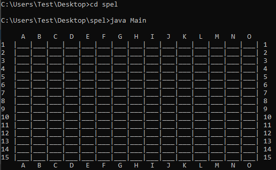
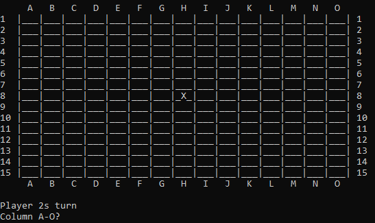
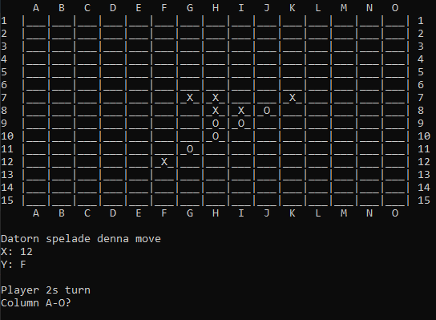

# 5-in-row-game

Using a the [Minimax algorithm](https://en.wikipedia.org/wiki/Minimax), utilizing a Tree Data Structure, Depth-First Search, Recursion and heuristics to create a simple board-game AI that will beat you most of the times in 5-in-a-row game

