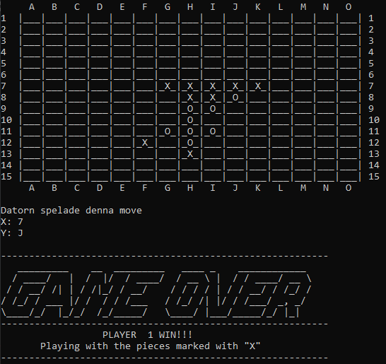

# 5-in-row-game

Using the [Minimax algorithm](https://en.wikipedia.org/wiki/Minimax), utilizing a Tree Data Structure, Depth-First Search, Recursion and heuristics to create a simple board-game AI that will beat you most of the times in 5-in-a-row game

  
Download, compile the java files and run "Main" to start the game. Or download the "spel.7z" zipfile with the precompiled java classes and run.  
To run, use cmd, navigate to the folder containing the ".class files" (the compiled java files).  
Start the game by typing "java Main". 

